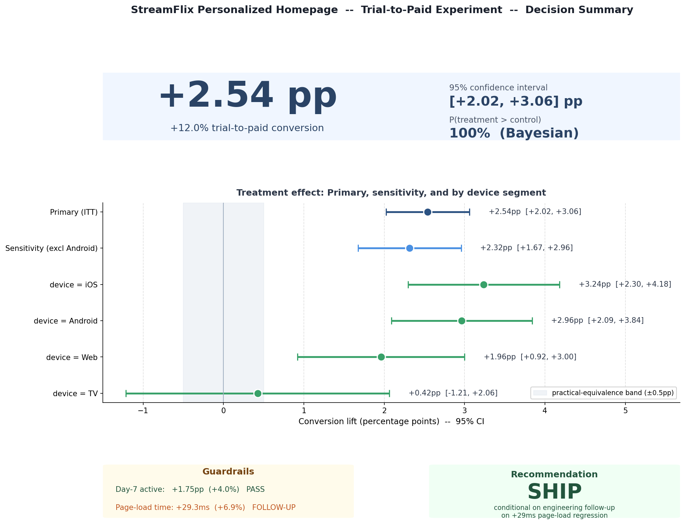

# 🧪 A/B Test Analysis — StreamFlix Trial-to-Paid Experiment


> **End-to-end A/B test analysis** for a streaming subscription product, built on a synthetic dataset patterned after real product-experiment dynamics. Demonstrates the full experimentation workflow: experiment design, data quality, frequentist & Bayesian analysis, heterogeneous treatment effects, variance reduction (CUPED), sensitivity/robustness testing, and stakeholder communication.

## TL;DR

**Question:** should StreamFlix ship a personalized homepage to all trial users?
**Answer:** **Ship**, conditional on an engineering ticket for a +29ms page-load regression.
**Evidence:** trial→paid conversion **+2.54pp** (21.26% → 23.80%, 95% CI [+2.02, +3.06]), positive in every segment, robust across six sensitivity checks.
**Caveats I'd raise in the room:** the SRM test (p = 0.0036) is not a clean pass and is traced to an Android assignment bug; the data are synthetic, so the pipeline is validated against *known* truth (true ATE +2.29pp, covered by the CI) rather than real-world plausibility.



**Fastest way in:** [`reports/PROJECT_SUMMARY.md`](./reports/PROJECT_SUMMARY.md) — single-page catalog of what was built + what was found, with every headline number traced to its source notebook. Start there for a 5-minute overview, then dive into [`reports/decision_memo.md`](./reports/decision_memo.md) for the stakeholder recommendation or `notebooks/` for the full analysis.

> 🔗 **Sister projects:** [`StreamFlix-Churn-Retention`](https://github.com/janeruxi1/StreamFlix-Churn-Retention) — cost-aware churn targeting — and [`StreamFlix-RAG-evaluation`](https://github.com/janeruxi1/StreamFlix-RAG-evaluation) — an evaluation harness for an AI support assistant — on the same StreamFlix context. The first two walk through the top-of-funnel and retention halves of a subscription product's decision loop; the third asks whether a support assistant is safe to deploy.

---

## 📌 Business Problem

**StreamFlix** is a subscription streaming service with a 14-day free trial.
The Growth PM believes a **personalized "Recommended For You" homepage**
will convert more trialists to paid than the existing **generic "Top Picks"**
homepage.

The PM ran a 4-week, 50/50, user-level randomized experiment on ~100k new
trialists. As the data scientist, I am asked to deliver:

> **Should we ship the personalized homepage to 100% of trial users?**

Full brief: [`reports/scenario_brief.md`](./reports/scenario_brief.md).

This is the canonical product DS question: **a decision under uncertainty, with multiple metrics, segments, and engineering tradeoffs.**

---

## 🎯 What This Project Demonstrates

| Skill | Where it shows up |
|---|---|
| Experiment scoping & metric framework | `reports/scenario_brief.md` |
| Synthetic dataset design with ground truth | `src/data/simulate.py` |
| Data quality & SRM checks | `notebooks/01_data_quality.py` |
| Power analysis & sample size | `notebooks/02_power_analysis.py` |
| Frequentist hypothesis testing | `notebooks/03_frequentist.py` |
| Bayesian inference | `notebooks/04_bayesian.py` |
| Heterogeneous treatment effects & Simpson's paradox | `notebooks/05_segmentation.py` |
| Variance reduction (CUPED) | `notebooks/05_segmentation.py` |
| Stakeholder decision memo | `reports/decision_memo.md` |
| Ground-truth recovery, CI coverage, formal HTE test, outcome maturity | `notebooks/08_validation_and_heterogeneity.py` |
| Hero decision-summary figure | `notebooks/06_hero_figure.py`, `reports/figures/06_hero_summary.png` |
| Interactive Streamlit demo | `app/streamlit_app.py` |
| Production code quality (tests, CI) | `src/`, `tests/`, `.github/workflows/` |

---

## 📊 Dataset (Synthetic)

Custom-designed to mirror a real product experiment — **fully reproducible**
from `src/data/simulate.py` (seed=42). 100,000 rows, 14 columns.

**Why synthetic?** Designing the dataset is itself a sign of experimentation
maturity. The simulator embeds known ground truth, realistic segments, a
pre-period covariate for CUPED, and engineered data-quality edge cases (SRM bug,
render glitch) that the analysis must detect — letting us verify the
analysis recovers the right answers and demonstrate handling of issues
that real product experiments routinely surface.

See [`data/README.md`](./data/README.md) for schema and ground-truth details.

```bash
python src/data/simulate.py    # regenerates data/experiment.csv
```

---

## 🗂️ Project Structure

```
StreamFlix-AB-Testing/
├── README.md                        # You are here
├── LICENSE                          # MIT
├── data/
│   ├── README.md                    # Schema & ground truth
│   └── experiment.csv               # Generated by simulate.py
├── notebooks/                       # Analyses and figure generators
│   ├── 01_data_quality.py / .ipynb      # SRM + covariate balance
│   ├── 02_power_analysis.py / .ipynb    # Sample size + MDE
│   ├── 03_frequentist.py / .ipynb       # z-test, CIs, Holm-Bonferroni
│   ├── 04_bayesian.py / .ipynb          # Beta-Binomial posterior, ROPE
│   ├── 05_segmentation.py / .ipynb      # HTE, CUPED, Simpson's
│   ├── 06_hero_figure.py                # Builds reports/figures/06_hero_summary.png
│   ├── 07_sensitivity_robustness.py     # 6 checks: weekly ATE, Pocock sequential looks, N-subsample, framework reconciliation, A/A test, bootstrap CI
│   └── 08_validation_and_heterogeneity.py  # Ground-truth recovery, CI coverage, maturity, interaction tests, Holm over segments
├── src/                             # Reusable, tested modules
│   ├── data/
│   │   ├── simulate.py              # Synthetic data generator
│   │   └── loader.py
│   └── analysis/
│       ├── sanity_checks.py         # SRM & balance
│       ├── power.py                 # Sample size & MDE
│       ├── frequentist.py           # z-test, Welch's, Holm-Bonferroni
│       ├── bayesian.py              # Beta-Binomial posterior
│       └── segmentation.py          # Segment lifts & CUPED
├── tests/                           # 62 pytest unit tests
│   ├── conftest.py
│   ├── test_power.py
│   ├── test_frequentist.py
│   ├── test_bayesian.py
│   ├── test_segmentation.py
│   ├── test_sanity_checks.py
│   ├── test_ground_truth.py         # pipeline recovers planted effects
│   └── test_simulate.py
├── reports/
│   ├── scenario_brief.md            # PM brief / business framing
│   ├── decision_memo.md             # Stakeholder-facing recommendation
│   └── figures/                     # Output PNGs
├── pytest.ini
├── requirements.txt
└── .github/workflows/ci.yml
```

---

## 🚀 Quick Start

```bash
pip install -r requirements.txt
python src/data/simulate.py            # generate the dataset
python notebooks/01_data_quality.py    # run the analysis scripts in order (01 ... 08)
pytest tests/                          # run the 62 unit tests
```

The `.py` scripts are the source of truth; the `.ipynb` files are generated companions and may lag behind.

---

## 🎮 Interactive demo (Streamlit)

Visitors can interact with the math without cloning the repo:

```bash
streamlit run app/streamlit_app.py
```

Two modes: **pre-experiment design** (slider-driven sample-size calculator with a sample-size-vs-MDE chart) and **post-experiment analysis** (paste in conversion counts, get frequentist + Bayesian results plus posterior chart). See [`app/README.md`](./app/README.md) for deployment to Streamlit Community Cloud.

The app imports directly from `src/analysis/`, so the math is the same as the notebooks and protected by the same unit tests.

**Live demo:** [https://janeruxi1-ab-testing-project.streamlit.app/](https://janeruxi1-ab-testing-project.streamlit.app/)

---

## 🧪 Testing & CI

The `src/` modules are covered by **62 pytest unit tests** that run on every push via GitHub Actions across Python 3.10, 3.11, and 3.12. Coverage spans:

- Power & sample-size math (textbook value, 1/MDE² scaling, unequal-arm formula)
- Frequentist tests (z-test, Welch's t, Holm-Bonferroni step-down)
- Bayesian inference (posterior bracketing, ROPE sums to 1, prior sensitivity)
- Segmentation & CUPED (variance reduction positive, theta identities)
- Synthetic data generator (column schema, reproducibility, sane ranges)
- Ground-truth recovery (CIs cover the simulator's true ATE and device effects) and outcome-maturity / SRM checks

Run locally: `pytest tests/`

---

## ⚠️ Limitations

- **Synthetic data.** The effect is planted, so recovery checks validate the pipeline rather than real-world plausibility, and a +12% relative lift is far larger than most real experiments produce.
- **SRM.** p = 0.0036 is not a clean pass. It is localized to Android and handled with a with/without-Android analysis, but the root cause is a hypothesis, not a finding.
- **Page-load tradeoff** uses a rough, assumption-based scale check, not a measured conversion-vs-latency relationship.
- **No revenue / LTV metric.** The decision is on conversion; a dollar-impact estimate (lift × price × retention) is a natural next step.
- Full list in [`reports/PROJECT_SUMMARY.md`](./reports/PROJECT_SUMMARY.md#limitations-honestly-named).

---

## 💼 Key methodological choices

- **Synthetic dataset with known ground truth** — control over scenario realism, lets the analysis recover and verify a true treatment effect
- **Metric framework** — primary, secondary, and guardrail tiers defined before unblinding, by decision-relevance rather than statistical convenience
- **SRM + covariate balance** — randomization sanity checks before any inference; a borderline SRM is treated as an incident, not waved through
- **Outcome maturity** — a 14-day metric is only analyzed after the last cohort's window closes
- **Ground-truth validation** — the simulator's true effects are compared with the estimates, and CI coverage is checked by simulation
- **MDE negotiated with the PM** — smallest lift worth shipping is a business decision, not a statistical one
- **Effect size + CI alongside every p-value** — point estimates without uncertainty bounds aren't actionable
- **Both frequentist and Bayesian inference** — frequentist for the process, Bayesian (P(T>C), credible interval) for stakeholder communication
- **Pre-specified segments, formal interaction tests, Holm over all segment tests** — limits post-hoc segment fishing
- **CUPED variance reduction** — uses a pre-experiment covariate to shrink CIs without more users
- **Simpson's-paradox check** — verifies aggregate effect is not masking segment-level dynamics
- **Page-load guardrail framed as tradeoff** — quantifies the engineering follow-up rather than blocking the ship decision

---

## 🔗 Related work

This project pairs with [`StreamFlix-Churn-Retention`](https://github.com/janeruxi1/StreamFlix-Churn-Retention), which handles the *retention* half of the same product's decision loop:

| | This project | Sister project |
|---|---|---|
| **Question** | Which homepage converts trialists to paid? | Which users to save from churn, and how? |
| **Method** | Randomized experiment | Predictive modeling + cost-aware policy |
| **Key skills** | A/B testing, power, CUPED, Bayesian | Feature engineering, gradient boosting, calibration, SHAP, uplift modeling, ROI optimization |
| **Deliverable** | Ship / don't ship decision | Per-user targeting policy |

Together they cover the two questions every subscription business asks: **who to acquire, and how to keep them.**

A third project in the same StreamFlix universe, [`StreamFlix-RAG-evaluation`](https://github.com/janeruxi1/StreamFlix-RAG-evaluation), takes on a different question: **is an AI support assistant safe to put in front of customers, and how would we know?** It evaluates a retrieval-augmented assistant with a hand-labelled test set, a validated LLM judge, and a deployment memo whose numbers are checked in CI.

---

## 📫 Author

Xi Ru · [LinkedIn](https://www.linkedin.com/in/xiru) · [Email](mailto:ruthruxi@gmail.com)
