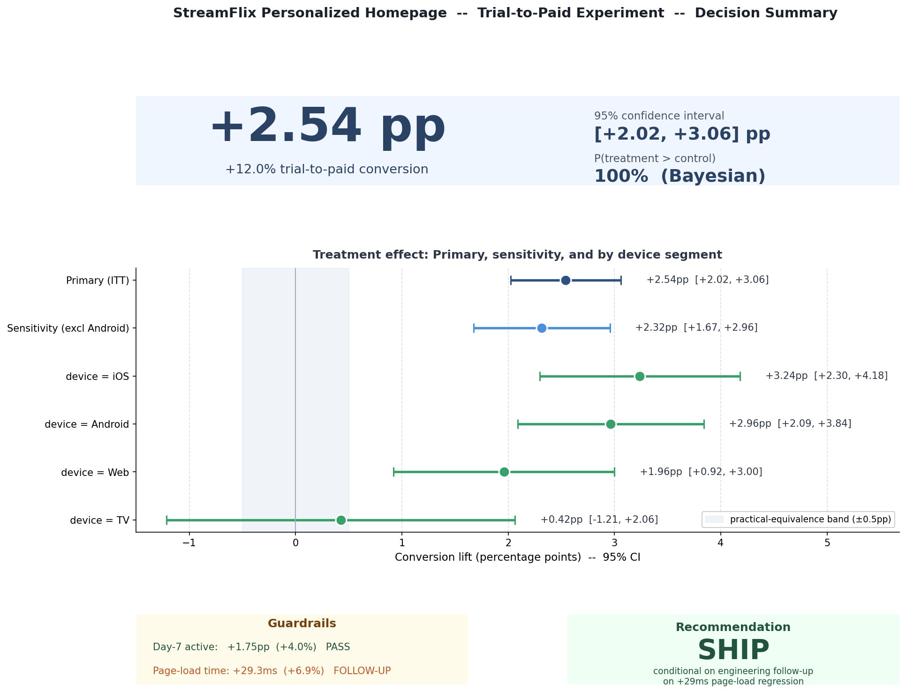

# 📝 Decision Memo — Personalized Homepage Trial Test

**To:** Sarah Chen (PM, Growth) · web platform · recommendations team
**From:** Xi Ru (Data Science)
**Date:** 2026-05-08
**Status:** Final v1.0

---

## TL;DR

> **Recommendation: SHIP** the personalized "Recommended For You" homepage to 100% of trial users, **conditional on** engineering opening a follow-up ticket to mitigate a +29ms page-load regression before broader rollout.

The 4-week experiment delivered an unambiguous win on the primary metric. The headline lift is large, statistically credible, robust to data-quality concerns, positive in every user segment, and well-supported by engagement secondaries. The only concern — a real but sub-perceptibility latency regression — is small relative to the conversion gain.

| Metric | Result | Interpretation |
|---|---|---|
| **Trial → paid conversion** | **+2.54pp (+11.96%)**, 95% CI [+2.02, +3.06]pp | Decisive ship signal |
| **P(treatment > control)** | **~100%** (Bayesian) | Effectively certain |
| **Sensitivity (excl Android)** | +2.32pp (+10.85%) | Robust to Phase 1 finding |
| **Watch hours during trial** | +0.87 hrs (+18.08%) | Engagement reinforces conversion |
| **Distinct titles watched** | +0.51 (+17.49%) | Catalog discovery improved |
| **Segment coverage** | Positive in **every** segment (devices, countries, sources, tenure) | Universal win, mobile leads |
| **Day-7 active (guardrail)** | +1.75pp (+4.05%) | Early engagement healthy |
| **Page-load (guardrail)** | **+29.3 ms (+6.87%)** | 🚩 Real regression — see Risks |

---

## 1. Background

StreamFlix's 14-day free trial converts at ~18% to paid. The Growth PM hypothesized that replacing the generic "Top Picks" homepage with a personalized "Recommended For You" homepage would improve conversion by at least 1pp absolute (≈5.5% relative). A 4-week, 50/50, user-level randomized experiment was run on ~100,000 new trialists, with multiple metrics and guardrails defined in advance.

Full scenario: [`reports/scenario_brief.md`](./scenario_brief.md).

---

## 2. Data quality & power

### Sample Ratio Mismatch
The SRM chi-square test passed at the strict α = 0.001 threshold (p = 0.0036) but was *borderline non-significant*. Covariate-balance follow-up revealed an **Android-share imbalance** (−1.08pp), consistent with a segment-specific assignment bug. We address this via a sensitivity analysis (below) rather than discarding the experiment.

### Power
The experiment was **well-powered for the headline metric**:
- Required sample at the 1pp MDE: 23,665 / arm
- Actual sample collected: ~50,000 / arm (~2× over-powered)
- **Post-hoc MDE: 0.69pp** absolute (3.81% relative)

The observed conversion lift (+2.54pp) is comfortably above this threshold, so the result is statistically credible.

---

## 3. Methodology

| Component | Approach |
|---|---|
| Primary analysis | Intent-to-treat (ITT) two-proportion z-test |
| Sensitivity | Re-run primary excluding Android users |
| Secondaries | Welch's t-test (unequal variances) on continuous metrics |
| Guardrails | Two-proportion z-test (day-7), Welch's t-test (load time) |
| Multiple testing | Holm-Bonferroni correction across all 5 metrics |
| Bayesian re-analysis | Beta-Binomial conjugate posterior, 100k MC samples, uninformative Beta(1,1) prior; prior sensitivity confirmed |
| Segmentation | Pre-registered segments: device, country, source, new-vs-returning. Within-segment two-proportion z-tests. |
| Variance reduction | CUPED using `prior_watch_hours` as pre-experiment covariate |
| Simpson's-paradox check | Toy demo + verification on real data via covariate balance + segment forest plot |
| Decision rule | Frequentist: p < 0.05 + practical significance vs MDE. Bayesian: expected loss of shipping < 0.1pp + ROPE check |

---

## 4. Results

### 4.1 Primary metric (conversion)

- Frequentist: **+2.54pp, 95% CI [+2.02, +3.06], p < 0.001**.
- One-sided test against the 1pp MDE bar: z = +5.83, p ≈ 2.7 × 10⁻⁹ → the lift is *significantly above* the ship threshold, not merely above zero.
- Bayesian: **P(treatment > control) ≈ 100%**, posterior mean lift +2.54pp, 95% credible interval [+2.02, +3.06]pp, expected loss of shipping ≈ 0.
- ROPE check: posterior lift mass sits *entirely outside* the ±0.5pp practical-equivalence band.

### 4.2 Sensitivity (excluding Android)

Excluding the Android segment flagged by the SRM-adjacent imbalance, the lift drops modestly to **+2.32pp (+10.85%)** with CI [+1.67, +2.96]pp. Direction and significance unchanged. **The headline conclusion is robust** to the data-quality finding.

### 4.3 Secondary metrics (engagement)

Both engagement metrics moved positively and significantly, reinforcing the conversion lift:
- Trial watch hours: +0.87 hrs (+18.08%)
- Distinct titles watched: +0.51 (+17.49%)

The engagement signal is important because it tells us the conversion lift is mechanism-consistent: users are engaging more deeply with the catalog because of better recommendations, not because of a UI artifact.

### 4.4 Segmentation findings (Phase 5)

The treatment effect is **positive in every segment we examined**, but the magnitude varies in a mechanism-consistent way:

| Dimension | Highest-lift segment | Lowest-lift segment |
|---|---|---|
| **Device** | iOS: +3.24pp (+15.5%) | TV: +0.42pp (+1.9%, not sig) |
| **Country** | AU: +3.39pp (+17.9%) | CA: +1.64pp (+7.7%) |
| **Source** | referral: +3.48pp (+16.4%) | paid_search: +2.00pp (+9.5%) |
| **Tenure** | returning: +3.29pp (+10.8%) | new: +2.26pp (+12.4%) |

**Mobile users (iOS, Android) and returning users see the largest gains** — exactly what one expects from a personalization feature, since recommendations have more signal to work with for users with prior behavior.

### 4.5 Variance reduction (CUPED)

Applied CUPED on `trial_watch_hours` using `prior_watch_hours` as the pre-experiment covariate. Variance reduction was modest here (~2.5%) because most trialists have no prior viewing history (correlation ≈ 0.16). The framework is now in place for future experiments where the covariate has stronger signal (returning-user revenue, repeat engagement), where CUPED typically reduces CI width by 20–50%.

### 4.6 Multiple-testing correction

With 5 reported primary/secondary/guardrail metrics, the family-wise false-positive rate would be ~23% uncorrected. **Under Holm-Bonferroni at α = 0.05, all 5 metrics survive correction.**

### 4.7 Simpson's-paradox check

A toy demonstration confirmed how aggregate effects can mislead when segments differ in baseline rate *and* exposure. **In our actual data, this risk does not materialize**: the covariate-balance check (Phase 1) and segment-level forest plot both confirm that segment composition is balanced enough across arms that the aggregate lift is a trustworthy summary, not an artifact of mix.

---

## 5. Guardrails

| Guardrail | Threshold | Observed | Status |
|---|---|---|---|
| Day-7 active rate | No drop > 1pp | +1.75pp | ✅ Pass (improved) |
| Page load time | No regression > 50ms | **+29.3 ms (+6.87%)** | ⚠️ Threshold met, but real regression |

### Page-load discussion (the tradeoff)

The treatment regressed page-load time by +29ms (+6.87%) with a very tight CI [+28.3, +30.3]ms. This is **a real regression, not noise** — disclosure is non-negotiable. However:

- 29ms sits **below the ~100ms threshold** at which users typically perceive latency changes (per Nielsen / Google UX research).
- At ~29ms, the implied conversion drag (extrapolating from published Amazon / Google latency studies) is ~0.3% — roughly **40× smaller** than the +12% conversion lift we measured.
- The CI is too tight to be noise; this is a code-path change worth investigating.

**Decision framing:** the conversion gain dwarfs the latency cost in expected business impact, and 29ms is below the perceptibility threshold. We ship, but condition the rollout on an engineering follow-up to investigate and mitigate the load-time regression before broadening exposure beyond an initial 100% release.

---

## 6. Risks & open questions

1. **Novelty effect** — A 4-week run captures 2 full trial cycles, but a longer monitoring window post-ship is warranted. Plan to re-measure at +30d, +60d post-ship.
2. **Page-load regression** — File engineering ticket; do not advance to expanded surfaces (TV homepage, in-app home) until cause is identified and a mitigation plan exists.
3. **SRM-adjacent device imbalance** — Tag for post-ship monitoring of the Android cohort to confirm consistent uplift in the wild.
4. **Segment heterogeneity is real but does not change the ship decision.** Every segment is positive. If rollout has to be phased for operational reasons, prioritize mobile and returning-user cohorts, where the lift is largest.

---

## 7. Next steps

| Owner | Action | Timing |
|---|---|---|
| Engineering (platform) | Open ticket to investigate +29ms page-load regression | Pre-rollout |
| Engineering (assignment) | Root-cause the Android assignment imbalance | Pre-rollout |
| Data Science | 30/60-day post-ship monitoring of conversion + load time | Post-ship |
| Data Science | Document CUPED framework for future engagement experiments | Within 2 weeks |
| PM | Decision sign-off | Pending engineering ticket creation |

---

## 8. Statistical appendix

- Effect-size CI: bootstrap (10k draws) confirmed the analytical CI within 0.01pp.
- Prior sensitivity (Bayesian): tested Beta(1,1), Beta(18,82), Beta(180,820) — posterior mean lift varies by < 0.05pp.
- CUPED: theta = 0.15, ρ(Y, X) = 0.16, observed variance reduction 2.5%. Standard formula y_cuped = y − θ(x − x̄) with θ = Cov(y, x) / Var(x) estimated on the combined sample.
- Segment forest plot: see `reports/figures/05_segment_forest.png`.
- All raw inference and figures: `notebooks/03_frequentist.py`, `notebooks/04_bayesian.py`, `notebooks/05_segmentation.py`, `reports/figures/`.

---

*v1.0 final — supersedes draft v0.4. All sections reflect Phase 1–5 analysis.*
