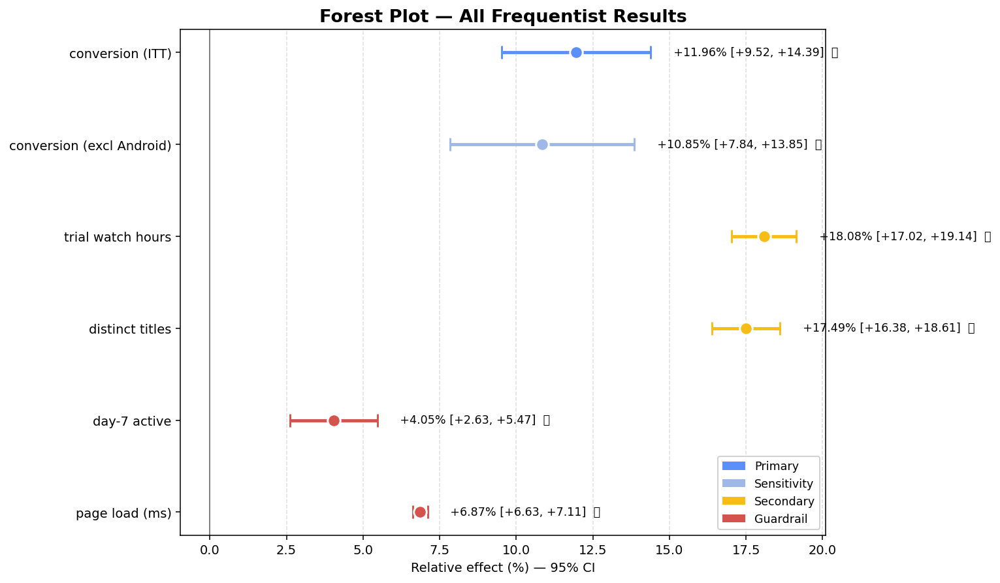

# 📝 Decision Memo — Personalized Homepage Trial Test

**To:** Sarah Chen (PM, Growth) · web platform · recommendations team
**From:** Xi Ru (Data Science)
**Date:** 2026-05-15 (after the last signup cohort's 14-day window closed on 2026-05-12)
**Status:** Final v1.1

---

## TL;DR

> **Recommendation: SHIP** the personalized "Recommended For You" homepage to 100% of trial users, **conditional on** engineering opening a follow-up ticket to mitigate a +29ms page-load regression before broader rollout.

The 4-week experiment delivered an unambiguous win on the primary metric. The headline lift is large, statistically credible, robust to data-quality concerns, positive in every user segment, and well-supported by engagement secondaries. The only concern — a real but sub-perceptibility latency regression — is small relative to the conversion gain.

| Metric | Result | Interpretation |
|---|---|---|
| **Trial → paid conversion** | **+2.54pp (+11.96%)**, 95% CI [+2.02, +3.06]pp | Decisive ship signal |
| **P(treatment > control)** | **~100%** (Bayesian) | Effectively certain |
| **Sensitivity (excl Android)** | +2.32pp (+10.85%) | Robust to Phase 1 finding |
| **Watch hours during trial** | +0.87 hrs (+18.08%) | Engagement reinforces conversion |
| **Distinct titles watched** | +0.51 (+17.49%) | Catalog discovery improved |
| **Segment coverage** | Positive in **every** segment (devices, countries, sources, tenure) | Universal win, mobile leads |
| **Day-7 active (guardrail)** | +1.75pp (+4.05%) | Early engagement healthy |
| **Page-load (guardrail)** | **+29.3 ms (+6.87%)** | 🚩 Real regression — see Risks |

---

## 1. Background

StreamFlix's 14-day free trial converts at ~18% to paid historically (the control arm in this experiment converted at 21.3%, so the 18% planning figure was conservative). The Growth PM hypothesized that replacing the generic "Top Picks" homepage with a personalized "Recommended For You" homepage would improve conversion by at least 1pp absolute (≈5.5% relative). A 4-week, 50/50, user-level randomized experiment was run on ~100,000 new trialists, with multiple metrics and guardrails defined in advance.

Full scenario: [`reports/scenario_brief.md`](./scenario_brief.md).

---

## 2. Data quality & power

### Sample Ratio Mismatch
The SRM chi-square test (50,461 control vs 49,539 treatment) gives p = 0.0036. That clears the α = 0.001 threshold commonly used for automated SRM alerts, but it is **not a clean pass**: many teams alert at 0.01, and a 0.9% split imbalance at this N is unlikely to be chance. Covariate-balance follow-up localized it to an **Android-share imbalance** (−1.08pp), consistent with a device-specific assignment bug. Because the loss is concentrated in one device and the remaining users are balanced on every other covariate, we treat it as a documented data-quality incident, run the primary analysis with and without Android (below), and make root-causing the bug a pre-rollout action. If the Android result had differed materially, the recommendation would have been *hold*, not ship.

### Power
The experiment was **well-powered for the headline metric**:
- Required sample at the 1pp MDE: 23,665 / arm
- Actual sample collected: ~50,000 / arm (~2× over-powered)
- **Post-hoc MDE: 0.69pp** absolute (3.81% relative)

The observed conversion lift (+2.54pp) is comfortably above this threshold, so the result is statistically credible.

---

## 3. Methodology

| Component | Approach |
|---|---|
| Primary analysis | Intent-to-treat (ITT) two-proportion z-test |
| Sensitivity | Re-run primary excluding Android users |
| Secondaries | Welch's t-test (unequal variances) on continuous metrics |
| Guardrails | Two-proportion z-test (day-7), Welch's t-test (load time) |
| Multiple testing | Holm-Bonferroni correction across all 5 metrics |
| Bayesian re-analysis | Beta-Binomial conjugate posterior, 100k MC samples, uninformative Beta(1,1) prior; prior sensitivity confirmed |
| Segmentation | Pre-specified (defined before looking at outcomes) segments: device, country, source, new-vs-returning. Within-segment two-proportion z-tests. |
| Variance reduction | CUPED using `prior_watch_hours` as pre-experiment covariate |
| Simpson's-paradox check | Toy demo + verification on real data via covariate balance + segment forest plot |
| Decision rule | Frequentist: p < 0.05 + practical significance vs MDE. Bayesian: expected loss of shipping < 0.1pp + ROPE check |

---

## 4. Results

### 4.1 Primary metric (conversion)

- Frequentist: **+2.54pp, 95% CI [+2.02, +3.06], p < 0.001**.
- One-sided test against the 1pp MDE bar: z = +5.83, p ≈ 2.7 × 10⁻⁹ → the lift is *significantly above* the ship threshold, not merely above zero.
- Bayesian: **P(treatment > control) ≈ 100%**, posterior mean lift +2.54pp, 95% credible interval [+2.02, +3.06]pp, expected loss of shipping ≈ 0.
- ROPE check: posterior lift mass sits *entirely outside* the ±0.5pp practical-equivalence band.

### 4.2 Sensitivity (excluding Android)

Excluding the Android segment flagged by the SRM-adjacent imbalance, the lift drops modestly to **+2.32pp (+10.85%)** with CI [+1.67, +2.96]pp. Direction and significance unchanged. **The headline conclusion is robust** to the data-quality finding.

### 4.3 Secondary metrics (engagement)

Both engagement metrics moved positively and significantly, reinforcing the conversion lift:
- Trial watch hours: +0.87 hrs (+18.08%)
- Distinct titles watched: +0.51 (+17.49%)

The engagement signal is important because it tells us the conversion lift is mechanism-consistent: users are engaging more deeply with the catalog because of better recommendations, not because of a UI artifact.

### 4.4 Segmentation findings (Phase 5)

The treatment effect is **positive in every segment we examined**, but the magnitude varies in a mechanism-consistent way:

| Dimension | Highest-lift segment | Lowest-lift segment |
|---|---|---|
| **Device** | iOS: +3.24pp (+15.5%) | TV: +0.42pp (+1.9%, not sig) |
| **Country** | AU: +3.39pp (+17.9%) | CA: +1.64pp (+7.7%) |
| **Source** | referral: +3.48pp (+16.4%) | paid_search: +2.00pp (+9.5%) |
| **Tenure** | returning: +3.29pp (+10.8%) | new: +2.26pp (+12.4%) |

**Mobile users (iOS, Android) see the largest gains, and TV the smallest.** A formal treatment × segment interaction test (logit likelihood-ratio test, `notebooks/08_validation_and_heterogeneity.py`) supports heterogeneity by **device** (p ≈ 0.01) but finds no evidence for it by country (p ≈ 0.58), source (p ≈ 0.42) or tenure (p ≈ 0.82). Returning users show a larger lift in percentage points mainly because their baseline conversion is higher; their *relative* lift (+10.8%) is actually below new users' (+12.4%). Differences across countries and sources are consistent with noise and should not drive phasing decisions. Across all 15 segment tests, 13 survive Holm correction; the exceptions are TV (underpowered) and CA (p = 0.046 uncorrected).

### 4.5 Variance reduction (CUPED)

Applied CUPED on `trial_watch_hours` using `prior_watch_hours` as the pre-experiment covariate. Variance reduction was modest here (~2.5%) because most trialists have no prior viewing history (correlation ≈ 0.16). The framework is now in place for future experiments where the covariate has stronger signal (returning-user revenue, repeat engagement), where CUPED typically reduces CI width by 20–50%.

### 4.6 Multiple-testing correction

With 5 reported primary/secondary/guardrail metrics, the family-wise false-positive rate would be ~23% uncorrected. **Under Holm-Bonferroni at α = 0.05, all 5 metrics survive correction.**

### 4.7 Simpson's-paradox check

A toy demonstration confirmed how aggregate effects can mislead when segments differ in baseline rate *and* arm exposure. **In this experiment we found no sign of it**: the lift is positive within every segment (so no sign reversal) and arms are balanced on every covariate except the small Android gap. Because randomization, not segment mix, drives the comparison, the aggregate is a valid summary; this is a check we ran, not a guarantee for future tests.

### 4.8 Sensitivity & robustness (Phase 7)

Beyond the direct sensitivity in 4.2 (excl-Android) and the framework diversity in 4.1 (Bayesian re-analysis), Phase 7 stress-tests the ship decision from **six additional angles**. All six support the ship recommendation:

| Check | Question | Result | Verdict |
|---|---|---|---|
| **A. Weekly ATE** | Is the +2.54pp lift stable, or a novelty spike that would decay? | Lift +2.68 / +2.51 / +3.03 / +1.95 pp across the 4 experiment weeks; pooled +2.54pp | ✅ Stable, no novelty decay |
| **B. Sequential looks (Pocock)** | If the team had peeked mid-experiment, would we have called the winner correctly under a proper α-spending correction? | \|z\| = 5.08 at end of week 1, well above the Pocock K=4 threshold of 2.361 | ✅ Early look would not have changed the call (illustrative; this was a fixed-horizon design) |
| **C. Sample-size sensitivity** | At what N does the decision flip? | Ship call holds down to a **10% subsample** (~10,000 users) | ✅ Full 100k was not required |
| **D. Bayesian ↔ Frequentist reconciliation** | Do both statistical frameworks agree on the ship decision? | Frequentist p ≈ 0 with +2.54pp lift; Bayesian P(T>C) = **100.00%** with matching +2.54pp posterior mean and near-identical 95% intervals | ✅ Frameworks agree |
| **E. A/A test** | Does the pipeline return "no effect" when there truly isn't one? | 500 random splits of control-only data → empirical false-positive rate **3.6%** (expected ~5%), median p-value 0.496 (uniform-consistent), p-values distributed across bins as expected | ✅ Pipeline validated on known-null data |
| **F. Bootstrap CI** | Does the analytical normal-approximation CI match a non-parametric bootstrap? | 10k-iteration Bernoulli bootstrap CI [+2.03, +3.06]pp vs analytical [+2.02, +3.06]pp — **max bound difference 0.004pp** | ✅ Normal approximation is safe |

**Read for stakeholders:** the +2.54pp headline is robust to (i) time-of-experiment novelty effects, (ii) peeking / sequential-look inflation, (iii) sample size (would have shipped at N/10), (iv) framework choice (frequentist and Bayesian give the same answer), (v) pipeline validation on known-null data, and (vi) CI-computation method. None of these are typical A/B-test failure modes.

See [`notebooks/07_sensitivity_robustness.py`](../notebooks/07_sensitivity_robustness.py) for the full analysis + charts (`reports/figures/07_weekly_ate.png`, `07_sequential_looks.png`).

---

## 5. Guardrails

Full metric coverage — every declared metric, at a glance:

| Guardrail | Threshold | Observed | Status |
|---|---|---|---|
| Day-7 active rate | No drop > 1pp | +1.75pp | ✅ Pass (improved) |
| Page load time | No regression > 50ms | **+29.3 ms (+6.87%)** | ⚠️ Threshold met, but real regression |

**Harm-test summary.** Of every declared metric (primary + 2 secondary + 2 guardrails), **only page-load moves against treatment**. All other movements are positive and significant. That's the ideal pattern for a shipping recommendation — one focused concern (page load), no scattered secondary-metric harm elsewhere.

### Page-load discussion (the tradeoff)

The treatment regressed page-load time by +29ms (+6.87%) with a very tight CI [+28.3, +30.3]ms. This is **a real regression, not noise** — disclosure is non-negotiable. However:

- 29ms sits **below the ~100ms threshold** at which users typically perceive latency changes (per Nielsen / Google UX research).
- Rough scale check: public latency studies report conversion sensitivities of well under 1% per 100ms for consumer web. Under a deliberately pessimistic assumption of 1% relative conversion loss per 100ms, 29ms implies ≈0.3% drag versus the +12% measured lift. This is an **assumption, not a measurement**: those studies are from retail and search, not streaming trials, so treat the "an order of magnitude or more smaller" conclusion as directional. The direct measurement of the effect on conversion is already inside the +2.54pp.
- The CI is too tight to be noise; this is a code-path change worth investigating.

**Decision framing:** on this rough scale check the conversion gain dwarfs the latency cost in expected business impact, and 29ms is below the perceptibility threshold. We ship, but condition the rollout on an engineering follow-up to investigate and mitigate the load-time regression before broadening exposure beyond an initial 100% release.

---

## 6. Risks & open questions

0. **Outcome maturity.** Conversion is a 14-day outcome and signups ran Apr 1–28, so the last window closed May 12. This memo is dated after that. An earlier readout (e.g. May 8) would have censored ~18% of users and understated conversion in the latest cohort (`outcome_maturity()` in `src/analysis/sanity_checks.py`).
1. **Novelty effect** — A 4-week run captures 2 full trial cycles, but a longer monitoring window post-ship is warranted. Plan to re-measure at +30d, +60d post-ship.
2. **Page-load regression** — File engineering ticket; do not advance to expanded surfaces (TV homepage, in-app home) until cause is identified and a mitigation plan exists.
3. **SRM-adjacent device imbalance** — Tag for post-ship monitoring of the Android cohort to confirm consistent uplift in the wild.
4. **Segment heterogeneity (device) is real but does not change the ship decision.** Every segment is positive. If rollout has to be phased for operational reasons, prioritize iOS and Android, where the lift is largest; the evidence for country/source/tenure differences is weak.

---

## 7. Next steps

| Owner | Action | Timing |
|---|---|---|
| Engineering (platform) | Open ticket to investigate +29ms page-load regression | Pre-rollout |
| Engineering (assignment) | Root-cause the Android assignment imbalance | Pre-rollout |
| Data Science | 30/60-day post-ship monitoring of conversion + load time | Post-ship |
| Data Science | Document CUPED framework for future engagement experiments | Within 2 weeks |
| PM | Decision sign-off | Pending engineering ticket creation |

---

## 8. Statistical appendix

- Effect-size CI: bootstrap (10k draws) confirmed the analytical CI within 0.01pp. A 300-replication simulation also gave 95.3% empirical coverage of the true ATE (Phase 8).
- Prior sensitivity (Bayesian): tested Beta(1,1), Beta(18,82), Beta(180,820) — posterior mean lift varies by < 0.05pp.
- CUPED: theta = 0.15, ρ(Y, X) = 0.16, observed variance reduction 2.5%. Standard formula y_cuped = y − θ(x − x̄) with θ = Cov(y, x) / Var(x) estimated on the combined sample.
- Segment forest plot: see `reports/figures/05_segment_forest.png`.
- All raw inference and figures: `notebooks/03_frequentist.py`, `notebooks/04_bayesian.py`, `notebooks/05_segmentation.py`, `reports/figures/`.

---

*v1.1 — adds ground-truth validation, formal heterogeneity tests and outcome-maturity note (Phase 8). The data is synthetic; see `data/README.md`.*
